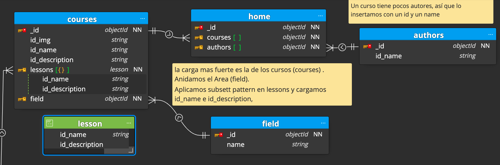
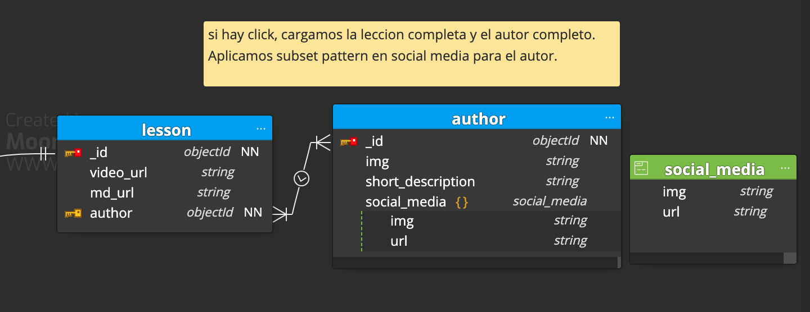
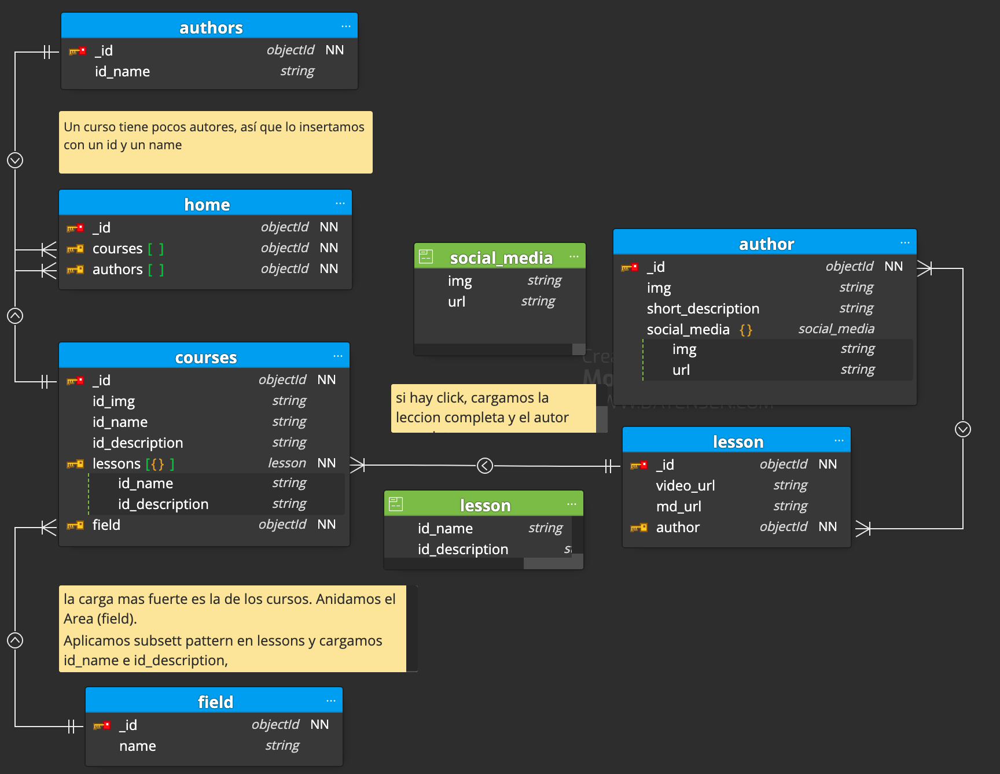

## First Load

- We bring courses and authors for our home landing page.

- It will have the author ID and Lessons ID With this, we cover the first click and it will result on a fast load. We expect to have 20 courses, and a exponential grow within the next months/years, so we could make a load-limit of firs 20 courses, and so on with a scroll-control.

- Lessons name and lessons description will be stored and loaded if we make a first click on any course showed up on our landing page.

- "Most viewed" / "Latest releases", we will filter them from CMD. Other categories filtered by field

## Second Load

- If click on a course, it will load lessons and authors from the previous call.
- If click on a lesson, we will call a second time to the APi and get the specific lesson ( video, markdown instructions) , and specific author ( picture, bio, and social media links).

# Full tree

