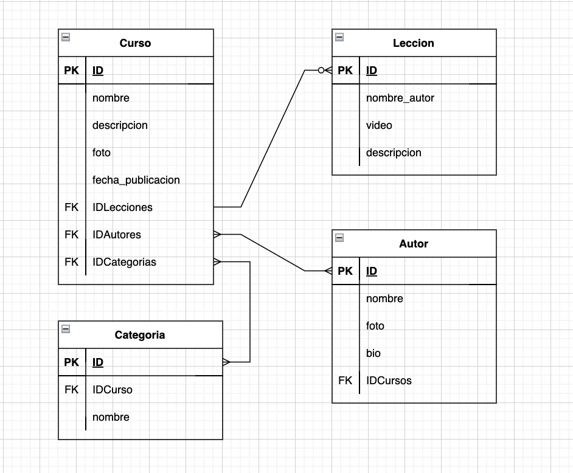

# Laboratorio - .NET - Modulo 1 - Modelado

## Descripción

Una startup tecnológica va a desarrollar un portal de ELearning y nos ha pedido que realizamos el modelo de datos de dicho sistema.

Va a ser un portal orientado al mundo de la programación.

El portal va a estar compuesto por cursos, cada curso está compuesto a su vez por un número de videos y artículos que lo acompañen.

Los videos y el contenido de cada artículo se almacenan en un storage S3 y en un headless CMS, en la base de datos sólo almacenaremos los Id's a esos recursos.

Los videos se puede clasificar por temáticas (Devops / Front End / Back End / ...)

Los videos tienen autores (un video solo tiene un autor), un curso puede tener varios autores.

## Diagrama

## Interacciones

#### Un curso

1. Contiene una o varias lecciones. Una lección, proviene de un curso. 1 to many

2. Puede tener uno o varios autores. Un autor, puede tener uno o varios cursos. Many to many.

3. Se agrupan por categorías. Un curso puede tener una o varias categorías, y una categoría puede contener uno o varios cursos. Many to many

#### Una lección

1. Contiene un nombre, un video, y una descripción, así como una fecha de publicación.

2. Una lección sólo tiene un autor.

#### Un autor

1. Contiene un nombre, una foto y una pequeña biografía, así como los cursos en los que ha participado.

## Workload, explicaciones y patrones

####1. La página home se va a visualizar a menudo.

- La categoría "ultimos cursos publicados" se carga con los 5 últimos cursos mediante el campo "fecha" que contienen las lecciones.

- Se cargan también 5 cursos de las otras categorias (DevOps, Front End, Back End, etc).

- Como estos van a tener un trafico muy alto, se aplica el patron extended ref, y así tenerlos ya cargados en memoria.

####2. Se espera una carga fuerte de lectura en página principal, lecciones y video..

- También aplicamos extended ref pattern, para tenerlo todo cargado ya.

####3. La página de autor se espera que no se consuma tan a menudo.

- Se enlaza fuera, por ello usaremos un Subset Pattern.
